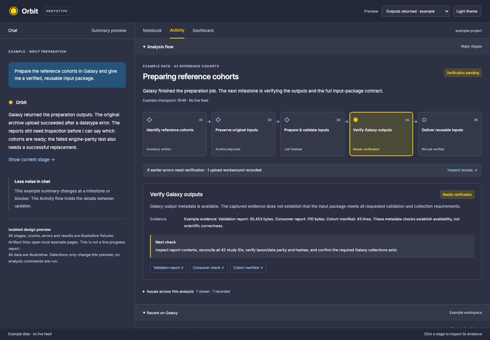

# Orbit Activity: analysis flow prototype

An interactive design proposal for an **Analysis flow** section above Recent on
Galaxy, Shell and Processes. It groups work into major stages and explains each
stage's evidence, next check, and specific errors. The prototype uses Orbit's
existing theme, fonts and tokens.

This PR is a standalone prototype, not live Activity integration. All input data
are illustrative; it starts no brain, model, Galaxy request, or analysis. The
browser consumes an explicit stage fixture rather than inferring semantics from
command names. The existing Orbit runtime is unchanged.

## Try it

From the repository root:

```sh
python3 -m http.server 8769 --bind 127.0.0.1
```

Open <http://127.0.0.1:8769/prototypes/analysis-flow/>. No dependencies or credentials
are needed. Serve via HTTP; browser module/JSON loading is not supported via
`file://`.



- Select a stage to see its purpose, evidence, next check and artifact links.
- Expand an error for its exception, impact and observed recovery.
- Browse errors by stage and optionally hide recovered issues.
- Switch among output-returned, queued, blocked, disconnected and empty examples.
- Collapse the flow, switch themes, or narrow the window for a vertical layout.
- Artifact links open a local, labeled example page in another tab. No fabricated
  Galaxy dataset/history URLs or real account/session identifiers are included.

## What the design distinguishes

Successful tool execution, available output datasets and verified results are
separate. An earlier successful replacement can support a recovery, but a later
unrelated success does not resolve every error. A queued view excludes later
completion evidence; a disconnected view cannot claim current execution. Empty
activity does not create a plan or invent completed steps.

`fixture.json` supplies all stage names and evidence as design examples, including
seven example errors across three stages. Nothing in it is scientific execution
evidence. Links go to `artifact.html`; the displayed archive/report states remain
examples even when the link opens successfully.

## Verification

See [verification.md](verification.md) for browser interaction checks. Production
runtime tests are not a substitute for reviewing the prototype visually. This PR
adds no application/extension runtime code or dependency changes.

## Proposed production boundary

Loom should own stage attribution and summaries. Orbit should render a bounded,
shell-neutral projection of the notebook and current session, not infer task
semantics from command names, run its own model, or maintain another plan store.

1. At a meaningful stage boundary, the existing agent turn supplies a short
   human label, purpose, and next check through a Loom-owned reporting tool.
   A stage describes observed work, not an automatically created plan. If an
   explicit notebook plan exists, reuse its anchors and dependencies.
2. Loom binds tool call IDs to the stage active when each call starts. Completion,
   errors and background Galaxy events remain attached to that stage even after
   the agent moves on. Concurrent stages have explicit dependency edges.
3. Error records retain the affected artifact, concise cause, impact, attempted
   recovery, and source event. A later successful call does not resolve an issue
   automatically. Record a successful replacement check before marking resolved.
4. Durable milestones and verification evidence stay in notebook prose and
   existing typed Galaxy records. The flow payload is a rebuildable session view,
   not an additional persisted plan database. Restore it from the selected
   session branch and notebook; clear it on project/session switch.
5. Add a typed widget contract with project/session identity, revision,
   observation timestamp, stages, dependencies, issues and evidence links.
   Suggested display states: observed, queued, running, verifying, verified,
   blocked, unknown. “Verified” requires notebook-recorded evidence. Unknown and
   stale updates must never imply continued execution.
6. Emit updates on stage transitions, artifact verification, and changed blockers.
   Use existing deterministic background Galaxy tracking. No extra model call
   per minute and no new polling loop. Chat gets a short milestone/blocker
   sentence; the panel holds recurring details and a local freshness indicator.
7. Redact secrets before excerpts enter the projection, bound all strings and
   event lists, validate link schemes/server identity, and keep raw output in the
   existing registered artifact/log paths. Never send raw commands to a summary
   model just to make this panel work.

The prototype has no command submission, retry, approval or cancellation buttons.
An integration would need scoped event wiring, deterministic evidence transitions,
session isolation, replay checks and real renderer validation before activation.
